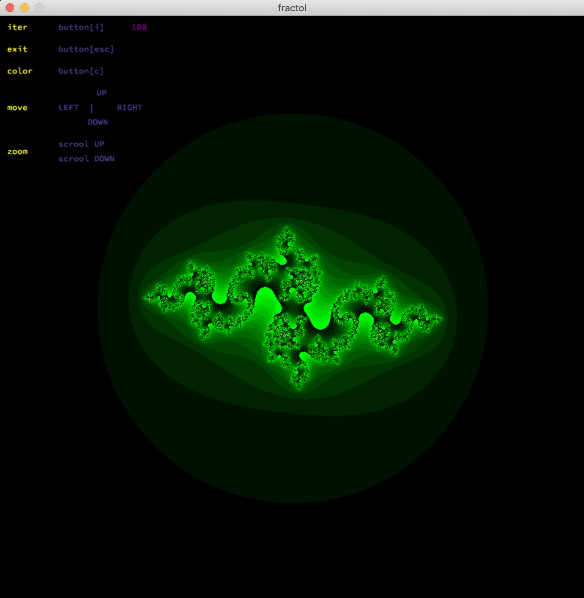
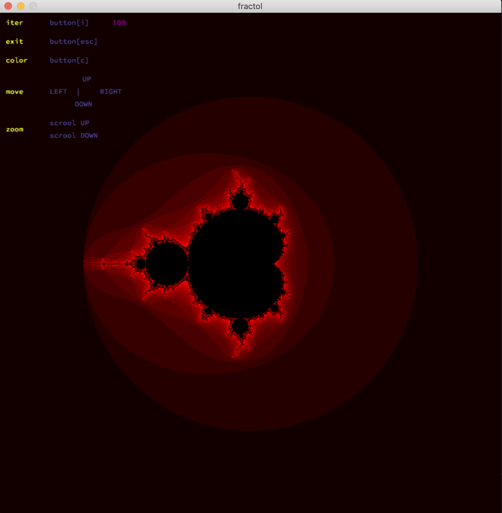

#Fract-ol

Fract-ol is a School 21 project. The purpose of this project is to create fractal renderer.

Note that **macOS** is only supported.

###How to clone

This repository without submodules, use just simply `git clone`
````
$git clone <repository url>
````
###Installation
Clone repository and then go into the created directory and run Makefile
````
make
````
###How to use program
You can use program with fallowing command:
````
./fractol [fractal_name]
````
For example:
````
./fractol julia
````



Or
````
./fractol mandelbrot
````


###Нou can use the following parameters:
````
$./fractal

-[mandelbrot]

-[bfly]

-[julia] [im] [re]
````

